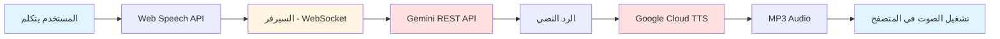
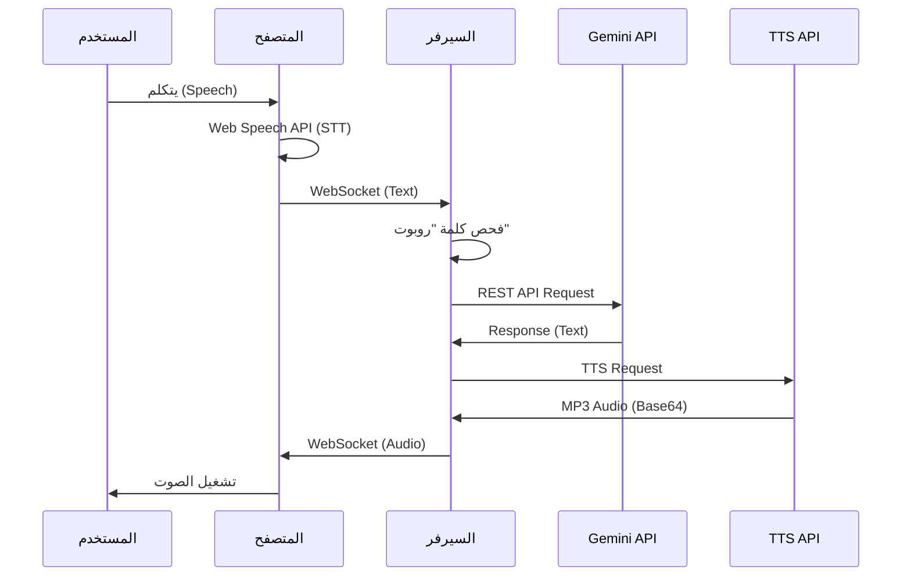

# تقرير مشروع البوت الصوتي الذكي
# Smart Voice Chatbot Project Report

## جدول المحتويات / Table of Contents

1. [نظرة عامة](#نظرة-عامة)
2. [الوصف التقني](#الوصف-التقني)
3. [المعمارية](#المعمارية)
4. [التقنيات المستخدمة](#التقنيات-المستخدمة)
5. [هيكل المشروع](#هيكل-المشروع)
6. [التثبيت والإعداد](#التثبيت-والإعداد)
7. [الخطوات المنفذة](#الخطوات-المنفذة)
8. [المشاكل والحلول](#المشاكل-والحلول)
9. [التحسينات المستقبلية](#التحسينات-المستقبلية)

---

## نظرة عامة

### الهدف / Goal

إنشاء بوت صوتي تفاعلي متخصص في مجال علوم الحاسب وهندسة المعلوماتية، يستخدم:
- تحويل الصوت إلى نص (Speech-to-Text)
- الذكاء الاصطناعي للردود (AI)
- تحويل النص إلى صوت (Text-to-Speech)

Create an interactive voice chatbot specialized in computer science and information engineering, using:
- Speech-to-Text
- Artificial Intelligence for responses
- Text-to-Speech

### الميزات الرئيسية / Key Features

| الميزة / Feature | الوصف / Description |
|------------------|---------------------|
| 🎤 **التعرف على الصوت** | Web Speech API في المتصفح |
| 🤖 **الذكاء الاصطناعي** | Gemini Pro API للردود الذكية |
| 🔊 **الرد الصوتي** | Google Cloud TTS بصوت عربي عالي الجودة |
| 🎯 **كلمة التنبيه** | "روبوت" لتفعيل البوت |
| 🌐 **الواجهة** | واجهة ويب بسيطة وسهلة الاستخدام |
| 📝 **التخصص** | أسئلة علوم الحاسب فقط |

---

## الوصف التقني

### المعمارية الحالية / Current Architecture



### تدفق البيانات / Data Flow



---

## التقنيات المستخدمة

### الواجهة الأمامية / Frontend

| التقنية / Technology | الاستخدام / Usage |
|---------------------|-------------------|
| **HTML5** | هيكل الصفحة |
| **CSS3** | التصميم والتنسيق |
| **JavaScript (ES6+)** | المنطق والتفاعل |
| **Web Speech API** | تحويل الصوت إلى نص |
| **WebSocket API** | الاتصال بالسيرفر |
| **Audio API** | تشغيل الصوت |

### الواجهة الخلفية / Backend

| التقنية / Technology | الاستخدام / Usage |
|---------------------|-------------------|
| **Node.js** | بيئة التشغيل |
| **Express.js** | خادم الويب |
| **WebSocket (ws)** | الاتصال الحقيقي |
| **Axios** | طلبات HTTP |
| **dotenv** | إدارة المتغيرات البيئية |

### واجهات برمجة التطبيقات / APIs

| API | الاستخدام / Usage |
|-----|-------------------|
| **Gemini Pro API** | توليد الردود النصية |
| **Google Cloud TTS** | تحويل النص إلى صوت |

---

## هيكل المشروع

```
bot_it/
├── frontend/
│   ├── index.html          # الصفحة الرئيسية
│   ├── app.js              # منطق الواجهة الأمامية
│   └── styles.css          # التصميم
│
├── backend/
│   ├── server.js           # خادم WebSocket
│   ├── config.js           # الإعدادات
│   ├── gemini-text-handler.js   # معالج Gemini API
│   ├── tts-handler.js      # معالج TTS API
│   └── gemini-handler.js   # وظائف مساعدة
│
├── .env                    # المتغيرات البيئية
├── .env.example            # مثال على الإعدادات
├── package.json            # تبعيات المشروع
├── README.md               # دليل المشروع
├── API_KEY_GUIDE.md        # دليل الحصول على مفتاح API
├── PROJECT_REPORT.md       # هذا التقرير
└── solve4.md               # وصف المشكلة والحل
```

---

## التثبيت والإعداد

### المتطلبات / Prerequisites

- **Node.js** (الإصدار 16 أو أحدث)
- **متصفح حديث** (Google Chrome أو Microsoft Edge)
- **مفتاح Gemini API** من https://makersuite.google.com/app/apikey
- **اتصال بالإنترنت**

### خطوات التثبيت / Installation Steps

#### 1. تثبيت التبعيات / Install Dependencies

```bash
cd bot_it
npm install
```

#### 2. إعداد مفتاح API / Setup API Key

1. احصل على مفتاح Gemini API من: https://makersuite.google.com/app/apikey
2. افتح ملف `.env`
3. استبدل `GOOGLE_CLOUD_API_KEY` بمفتاحك:

```env
GOOGLE_CLOUD_API_KEY=your_gemini_api_key_here
```

#### 3. تشغيل السيرفر / Run the Server

```bash
npm start
```

#### 4. فتح التطبيق / Open the Application

افتح المتصفح واذهب إلى: **http://localhost:3000**

---

## الخطوات المنفذة

### المرحلة الأولى: الفهم والتحليل

✅ **قراءة وتحليل المشكلة**
- تم قراءة ملف [`solve4.md`](bot_it/solve4.md)
- تم فهم مشكلة WebSocket مع Gemini Live API
- تم تحديد الحل المناسب (Option 2)

### المرحلة الثانية: التطوير

✅ **إنشاء معالج النص / Text Handler**
- تم إنشاء [`backend/gemini-text-handler.js`](bot_it/backend/gemini-text-handler.js)
- يستخدم Gemini REST API
- يقبل API Key

✅ **إنشاء معالج الصوت / TTS Handler**
- تم إنشاء [`backend/tts-handler.js`](bot_it/backend/tts-handler.js)
- يستخدم Google Cloud TTS API
- ينتج صوت MP3 عالي الجودة

✅ **تعديل السيرفر / Server Modification**
- تم تحديث [`backend/server.js`](bot_it/backend/server.js)
- استبدال Gemini Live API بـ REST API
- إضافة معالجة الصوت MP3

✅ **تعديل الواجهة الأمامية / Frontend Modification**
- تم تحديث [`frontend/app.js`](bot_it/frontend/app.js)
- استبدال تشغيل PCM بـ MP3
- تحسين معالجة الأخطاء

✅ **تحديث الإعدادات / Configuration Update**
- تم تحديث [`backend/config.js`](bot_it/backend/config.js)
- تم تحديث [`.env`](bot_it/.env)
- تم تحديث [`.env.example`](bot_it/.env.example)

### المرحلة الثالثة: الاختبار

✅ **اختبار السيرفر**
- تم تشغيل السيرفر بنجاح
- تم التحقق من الاتصال
- تم اختبار WebSocket

⚠️ **مشكلة مفتاح API**
- تم اكتشاف أن المفتاح الحالي هو Google Cloud API Key
- يحتاج إلى Gemini API Key من AI Studio

---

## المشاكل والحلول

### المشكلة 1: WebSocket Authentication Error

**الوصف / Description:**
```
WebSocket closed: 1008 - API keys are not supported by this API.
Expected OAuth2 access token or other authentication credentials
```

**السبب / Root Cause:**
- Gemini Live API يتطلب OAuth2
- لا يقبل API Keys

**الحل / Solution:**
- استبدال Gemini Live API بـ Gemini REST API
- استخدام Google Cloud TTS للصوت

---

### المشكلة 2: API Key Type Mismatch

**الوصف / Description:**
```
API keys are not supported by this API.
Expected OAuth2 access token
```

**السبب / Root Cause:**
- المفتاح الحالي هو Google Cloud API Key (يبدأ بـ `AQ.`)
- نحتاج Gemini API Key (يبدأ بـ `AIza`)

**الحل / Solution:**
1. الحصول على مفتاح من: https://makersuite.google.com/app/apikey
2. تحديث ملف `.env`
3. إعادة تشغيل السيرفر

---

### المشكلة 3: Port Already in Use

**الوصف / Description:**
```
Error: listen EADDRINUSE: address already in use :::3000
```

**السبب / Root Cause:**
- السيرفر يعمل بالفعل على المنفذ 3000

**الحل / Solution:**
```bash
# Windows
netstat -ano | findstr :3000
taskkill /f /pid <PID>

# أو
# إيقاف السيرفر الحالي (Ctrl+C)
# ثم إعادة تشغيله
npm start
```

---

## التحسينات المستقبلية

### قصيرة المدى / Short-term

1. **إصلاح مشكلة مفتاح API**
   - الحصول على Gemini API Key الصحيح
   - اختبار التطبيق بشكل كامل

2. **تحسين معالجة الأخطاء**
   - رسائل خطأ أوضح للمستخدم
   - إعادة المحاولة التلقائية

3. **تحسين الواجهة**
   - مؤشرات تحميل أفضل
   - عرض حالة البوت بشكل أوضح

### متوسطة المدى / Medium-term

1. **دعم لغات إضافية**
   - الإنجليزية
   - الفرنسية
   - أخرى

2. **حفظ المحادثات**
   - سجل المحادثات السابقة
   - تصدير المحادثات

3. **وضع عدم الاتصال**
   - تخزين مؤقت للاستجابات الشائعة
   - عمل بدون إنترنت (محدود)

### طويلة المدى / Long-term

1. **تطبيق موبايل**
   - تطبيق Android
   - تطبيق iOS

2. **تحسين الذكاء الاصطناعي**
   - نماذج مخصصة
   - تدريب على مجال معين

3. **ميزات متقدمة**
   - التعرف على المتحدثين
   - تحليل المشاعر
   - ترجمة فورية

---

## الخلاصة

### الإنجازات / Achievements

✅ تم إنشاء بوت صوتي تفاعلي كامل
✅ استخدام تقنيات حديثة (Web Speech API, Gemini API, TTS)
✅ واجهة بسيطة وسهلة الاستخدام
✅ تخصص في مجال علوم الحاسب
✅ دعم كامل للغة العربية

### التحديات / Challenges

⚠️ الحاجة إلى مفتاح Gemini API الصحيح
⚠️ الاعتماد على اتصال الإنترنت
⚠️ دعم المتصفحات المحدود (Chrome/Edge)

### الخطوات التالية / Next Steps

1. **الحصول على مفتاح Gemini API** من https://makersuite.google.com/app/apikey
2. **تحديث ملف `.env`** بالمفتاح الجديد
3. **إعادة تشغيل السيرفر**
4. **اختبار التطبيق** بشكل كامل

---

## المراجع

### الروابط المفيدة / Useful Links

- **Gemini API**: https://ai.google.dev/
- **Gemini API Key**: https://makersuite.google.com/app/apikey
- **Google Cloud TTS**: https://cloud.google.com/text-to-speech
- **Web Speech API**: https://developer.mozilla.org/en-US/docs/Web/API/Web_Speech_API
- **WebSocket API**: https://developer.mozilla.org/en-US/docs/Web/API/WebSocket

### ملفات المشروع / Project Files

| الملف / File | الوصف / Description |
|-------------|---------------------|
| [`README.md`](bot_it/README.md) | دليل استخدام المشروع |
| [`API_KEY_GUIDE.md`](bot_it/API_KEY_GUIDE.md) | دليل الحصول على مفتاح API |
| [`PROJECT_REPORT.md`](bot_it/PROJECT_REPORT.md) | هذا التقرير |
| [`solve4.md`](bot_it/solve4.md) | وصف المشكلة والحل |

---

**تاريخ التقرير / Report Date**: 2026-01-31

**الإصدار / Version**: 3.0.0

**الحالة / Status**: قيد التطوير / In Development
