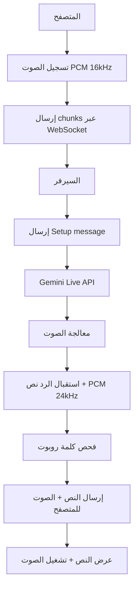

# خطة ترحيل مشروع روبوت الدردشة الصوتية إلى Gemini Live API

## ملخص التنفيذ

هذه الخطة تفصّل كيفية ترحيل المشروع من استخدام REST API إلى **Gemini Live API (WebSocket)** لدعم المودل `gemini-live-2.5-flash-native-audio`.

---

## 1. المشكلة الحالية

### Root Cause
- المودل `gemini-live-2.5-flash-native-audio` **لا يدعم** REST endpoint
- يتطلب اتصال WebSocket ثنائي الاتجاه (Bidirectional)
- Endpoint مختلف تماماً عن REST API

### الحل المطلوب
استبدال REST API بـ WebSocket client للاتصال بـ Gemini Live API

---

## 2. المواصفات التقنية

### صيغة الصوت المطلوبة

| الاتجاه | الصيغة | التفاصيل |
|---------|--------|-----------|
| **Input** | PCM 16-bit | 16kHz, little-endian, mono |
| **Output** | PCM 16-bit | 24kHz, little-endian |

### Endpoint الصحيح لـ Gemini Live API

```
wss://{REGION}-aiplatform.googleapis.com/ws/google.ai.generativelanguage.v1alpha.GenerativeService.BidiGenerateContent
```

أو حسب Vertex AI:

```
wss://{REGION}-aiplatform.googleapis.com/ws/v1/publishers/google/models/{MODEL}:streamGenerateContent
```

### Region المدعومة
- `us-central1` (الأفضل)
- أو أي region من القائمة في التوثيق

---

## 3. هيكل الملفات الجديد

```
bot_it/
├── backend/
│   ├── config.js                  # تحديث الإعدادات
│   ├── gemini-live-client.js      # ✨ جديد: WebSocket client لـ Live API
│   ├── audio-processor.js         # ✨ جديد: معالجة PCM
│   └── server.js                  # تحديث لاستخدام Live API
├── frontend/
│   ├── index.html
│   ├── styles.css
│   ├── app.js                     # تحديث لتسجيل PCM
│   └── pcm-processor.js           # ✨ جديد: AudioWorklet للتسجيل
├── .env.example                   # تحديث
├── .env                           # تحديث
└── package.json                   # تحديث التبعيات
```

---

## 4. ملف .env الجديد

```env
# Gemini Live API
GOOGLE_CLOUD_API_KEY=your_key_here
VERTEX_REGION=us-central1
VERTEX_MODEL=gemini-live-2.5-flash-native-audio

# Voice Settings
VOICE_NAME=Aoede
RESPONSE_MODALITIES=AUDIO,TEXT

# App Settings
WAKE_WORD=روبوت
PORT=3000

# Debug
DEBUG_MODE=true
SAVE_AUDIO_FILES=true
```

---

## 5. تدفق العمل الجديد (Flow)



---

## 6. المهام المطلوبة

### A. Backend Changes

#### 1. تحديث `backend/config.js`
```javascript
const config = {
  // Gemini Live API Configuration
  googleCloudApiKey: process.env.GOOGLE_CLOUD_API_KEY || '',
  vertexRegion: process.env.VERTEX_REGION || 'us-central1',
  vertexModel: process.env.VERTEX_MODEL || 'gemini-live-2.5-flash-native-audio',
  
  // Live API Endpoint
  liveApiEndpoint: `wss://${process.env.VERTEX_REGION || 'us-central1'}-aiplatform.googleapis.com/ws/google.ai.generativelanguage.v1alpha.GenerativeService.BidiGenerateContent`,
  
  // Voice Settings
  voiceName: process.env.VOICE_NAME || 'Aoede',
  responseModalities: (process.env.RESPONSE_MODALITIES || 'AUDIO,TEXT').split(','),
  
  // Audio Configuration
  inputSampleRate: 16000,  // 16kHz for input
  outputSampleRate: 24000, // 24kHz for output
  audioChannels: 1,        // Mono
  
  // Wake Word Configuration
  wakeWord: process.env.WAKE_WORD || 'روبوت',
  
  // Server Configuration
  port: process.env.PORT || 3000,
  
  // Debug Configuration
  debugMode: process.env.DEBUG_MODE === 'true' || false,
  saveAudioFiles: process.env.SAVE_AUDIO_FILES === 'true' || false,
  
  // System Instruction
  systemInstruction: `أنت مساعد صوتي متخصص في هندسة المعلوماتية وعلوم الحاسب فقط. إذا كان السؤال خارج هذا النطاق اعتذر باختصار. أجب بالعربية وبشكل واضح ومختصر مناسب للصوت.`
};
```

#### 2. إنشاء `backend/gemini-live-client.js` (جديد)

**الوظائف المطلوبة:**
- إنشاء اتصال WebSocket مع Gemini Live API
- إرسال Setup message
- إرسال الصوت كـ realtimeInput
- استقبال الرد (نص + صوت)
- إدارة دورة حياة الاتصال

**المفاهيم الأساسية:**

```javascript
class GeminiLiveClient {
  constructor(config) {
    this.config = config;
    this.ws = null;
    this.isConnected = false;
    this.sessionId = null;
  }

  // إنشاء اتصال WebSocket
  async connect() {
    const ws = new WebSocket(this.config.liveApiEndpoint, {
      headers: {
        'Authorization': `Bearer ${this.config.googleCloudApiKey}`
      }
    });
    
    // Setup event handlers
    ws.on('open', () => this.handleOpen());
    ws.on('message', (data) => this.handleMessage(data));
    ws.on('error', (error) => this.handleError(error));
    ws.on('close', () => this.handleClose());
    
    this.ws = ws;
  }

  // إرسال Setup message
  sendSetup() {
    const setupMessage = {
      setup: {
        model: `models/${this.config.vertexModel}`,
        generationConfig: {
          responseModalities: this.config.responseModalities,
          speechConfig: {
            voiceConfig: {
              prebuiltVoiceConfig: {
                voiceName: this.config.voiceName
              }
            }
          }
        },
        systemInstruction: {
          parts: [{
            text: this.config.systemInstruction
          }]
        }
      }
    };
    
    this.ws.send(JSON.stringify(setupMessage));
  }

  // إرسال الصوت كـ realtimeInput
  sendAudio(base64PCMData) {
    const message = {
      realtimeInput: {
        mediaChunks: [{
          mimeType: "audio/pcm",
          data: base64PCMData
        }]
      }
    };
    
    this.ws.send(JSON.stringify(message));
  }

  // استقبال الرد
  handleMessage(data) {
    const response = JSON.parse(data);
    
    // قد يحتوي على:
    // - serverContent.modelTurn.parts[].text (النص)
    // - serverContent.modelTurn.parts[].inlineData (الصوت)
    // - serverContent.turnComplete (انتهاء الدور)
    
    if (response.serverContent) {
      const modelTurn = response.serverContent.modelTurn;
      if (modelTurn && modelTurn.parts) {
        for (const part of modelTurn.parts) {
          if (part.text) {
            // معالجة النص
            this.emit('text', part.text);
          }
          if (part.inlineData && part.inlineData.data) {
            // معالجة الصوت
            this.emit('audio', part.inlineData.data);
          }
        }
      }
    }
    
    if (response.serverContent && response.serverContent.turnComplete) {
      this.emit('turnComplete');
    }
  }

  // إغلاق الاتصال
  disconnect() {
    if (this.ws) {
      this.ws.close();
    }
  }
}
```

#### 3. إنشاء `backend/audio-processor.js` (جديد)

**الوظائف المطلوبة:**
- تحويل Float32 إلى PCM 16-bit
- Resampling الصوت من 16kHz إلى 24kHz (للمخرجات)
- معالجة chunks الصوتية

```javascript
class AudioProcessor {
  constructor(config) {
    this.config = config;
  }

  // تحويل Float32 إلى PCM 16-bit
  floatTo16BitPCM(float32Array) {
    const buffer = new ArrayBuffer(float32Array.length * 2);
    const view = new DataView(buffer);
    for (let i = 0; i < float32Array.length; i++) {
      let s = Math.max(-1, Math.min(1, float32Array[i]));
      view.setInt16(i * 2, s < 0 ? s * 0x8000 : s * 0x7FFF, true); // little-endian
    }
    return buffer;
  }

  // تحويل PCM 16-bit إلى Float32
  pcm16ToFloat32(pcmData) {
    const float32 = new Float32Array(pcmData.byteLength / 2);
    const dataView = new DataView(pcmData);
    for (let i = 0; i < float32.length; i++) {
      float32[i] = dataView.getInt16(i * 2, true) / 32768;
    }
    return float32;
  }

  // Resampling (من 16kHz إلى 24kHz)
  resamplePCM16To24(pcmData, fromSampleRate, toSampleRate) {
    // تطبيق خوارزمية resampling
    // يمكن استخدام مكتبة مثل resampler.js أو تنفيذ يدوي
    const ratio = toSampleRate / fromSampleRate;
    const outputLength = Math.floor(pcmData.length / 2 * ratio);
    const output = new Int16Array(outputLength);
    
    for (let i = 0; i < outputLength; i++) {
      const sourceIndex = Math.floor(i / ratio);
      output[i] = pcmData[sourceIndex];
    }
    
    return output;
  }

  // تحويل Buffer إلى Base64
  bufferToBase64(buffer) {
    return buffer.toString('base64');
  }

  // تحويل Base64 إلى Buffer
  base64ToBuffer(base64) {
    return Buffer.from(base64, 'base64');
  }
}
```

#### 4. تحديث `backend/server.js`

**التغييرات المطلوبة:**
- استبدال `gemini-handler.js` بـ `gemini-live-client.js`
- استخدام `audio-processor.js` لمعالجة الصوت
- تحديث منطق WebSocket للتعامل مع Live API

**التغييرات الرئيسية:**

```javascript
const { GeminiLiveClient } = require('./gemini-live-client');
const { AudioProcessor } = require('./audio-processor');

// إنشاء عميل Live API لكل جلسة
const liveClients = new Map();

function createLiveSession(session) {
  const client = new GeminiLiveClient(config);
  const processor = new AudioProcessor(config);
  
  liveClients.set(session.id, { client, processor });
  
  // الاتصال بـ Live API
  client.connect();
  
  // إرسال Setup message
  client.on('open', () => {
    client.sendSetup();
  });
  
  // استقبال النص من Live API
  client.on('text', (text) => {
    // فحص كلمة "روبوت"
    if (text.includes(session.wakeWord)) {
      sendMessage(session.ws, 'text', { text });
    }
  });
  
  // استقبال الصوت من Live API
  client.on('audio', (base64Audio) => {
    sendMessage(session.ws, 'audio', { data: base64Audio });
  });
  
  return { client, processor };
}

// تحديث معالجة البيانات الصوتية
async function handleAudioData(session, audioData) {
  const liveSession = liveClients.get(session.id);
  if (!liveSession) {
    liveSession = createLiveSession(session);
  }
  
  const { client, processor } = liveSession;
  
  // تحويل الصوت إلى PCM 16-bit 16kHz
  const pcmData = processor.floatTo16BitPCM(audioData);
  const base64PCM = processor.bufferToBase64(pcmData);
  
  // إرسال الصوت لـ Live API
  client.sendAudio(base64PCM);
}
```

---

### B. Frontend Changes

#### 1. تحديث `frontend/app.js`

**التغييرات المطلوبة:**
- استخدام AudioWorklet أو ScriptProcessorNode
- تسجيل بصيغة PCM 16-bit 16kHz mono
- إرسال chunks بشكل مستمر

**التغييرات الرئيسية:**

```javascript
// تحديث AUDIO_CONFIG
const AUDIO_CONFIG = {
  sampleRate: 16000,
  channelCount: 1,
  mimeType: 'audio/pcm' // PCM format
};

// استخدام AudioWorklet
async function initAudioContext() {
  audioContext = new (window.AudioContext || window.webkitAudioContext)({
    sampleRate: AUDIO_CONFIG.sampleRate
  });
  
  // تحميل AudioWorklet
  await audioContext.audioWorklet.addModule('/pcm-processor.js');
  
  pcmProcessor = new AudioWorkletNode(audioContext, 'pcm-processor');
  pcmProcessor.port.onmessage = (event) => {
    const { pcmData } = event.data;
    const base64PCM = arrayBufferToBase64(pcmData);
    sendAudioData(base64PCM);
  };
}

// بدء التسجيل
async function startRecording() {
  const stream = await navigator.mediaDevices.getUserMedia({
    audio: {
      sampleRate: AUDIO_CONFIG.sampleRate,
      channelCount: AUDIO_CONFIG.channelCount,
      echoCancellation: true,
      noiseSuppression: true,
      autoGainControl: true
    }
  });
  
  const source = audioContext.createMediaStreamSource(stream);
  source.connect(pcmProcessor);
  pcmProcessor.connect(audioContext.destination);
}

// تحويل ArrayBuffer إلى Base64
function arrayBufferToBase64(buffer) {
  const bytes = new Uint8Array(buffer);
  let binary = '';
  for (let i = 0; i < bytes.byteLength; i++) {
    binary += String.fromCharCode(bytes[i]);
  }
  return btoa(binary);
}
```

#### 2. إنشاء `frontend/pcm-processor.js` (جديد)

**الوظائف المطلوبة:**
- معالجة الصوت في real-time
- تحويل Float32 إلى PCM 16-bit
- إرسال chunks بشكل مستمر

```javascript
class PCMProcessor extends AudioWorkletProcessor {
  constructor() {
    super();
    this.bufferSize = 4096; // حجم chunk
    this.buffer = new Float32Array(this.bufferSize);
    this.bufferIndex = 0;
  }

  process(inputs, outputs) {
    const input = inputs[0];
    const output = outputs[0];
    
    if (input.length > 0) {
      const inputChannel = input[0];
      
      // نسخ البيانات للـ buffer
      for (let i = 0; i < inputChannel.length; i++) {
        this.buffer[this.bufferIndex] = inputChannel[i];
        this.bufferIndex++;
        
        // إرسال buffer عند امتلائه
        if (this.bufferIndex >= this.bufferSize) {
          const pcmData = this.floatTo16BitPCM(this.buffer);
          this.port.postMessage({ pcmData });
          
          // إعادة تعيين buffer
          this.bufferIndex = 0;
        }
      }
    }
    
    return true;
  }

  // تحويل Float32 إلى PCM 16-bit
  floatTo16BitPCM(float32Array) {
    const buffer = new ArrayBuffer(float32Array.length * 2);
    const view = new DataView(buffer);
    for (let i = 0; i < float32Array.length; i++) {
      let s = Math.max(-1, Math.min(1, float32Array[i]));
      view.setInt16(i * 2, s < 0 ? s * 0x8000 : s * 0x7FFF, true);
    }
    return buffer;
  }
}

registerProcessor('pcm-processor', PCMProcessor);
```

#### 3. تحديث تشغيل الصوت المستلم

```javascript
// تشغيل PCM 24kHz
function playPCMAudio(base64PCM) {
  const pcmData = atob(base64PCM);
  const arrayBuffer = new ArrayBuffer(pcmData.length);
  const view = new Uint8Array(arrayBuffer);
  for (let i = 0; i < pcmData.length; i++) {
    view[i] = pcmData.charCodeAt(i);
  }
  
  // تحويل إلى Float32 للتشغيل
  const audioContext = new AudioContext({ sampleRate: 24000 });
  const float32 = new Float32Array(arrayBuffer.byteLength / 2);
  const dataView = new DataView(arrayBuffer);
  for (let i = 0; i < float32.length; i++) {
    float32[i] = dataView.getInt16(i * 2, true) / 32768;
  }
  
  const audioBuffer = audioContext.createBuffer(1, float32.length, 24000);
  audioBuffer.getChannelData(0).set(float32);
  
  const source = audioContext.createBufferSource();
  source.buffer = audioBuffer;
  source.connect(audioContext.destination);
  source.start();
}
```

---

### C. منطق كلمة التنبيه "روبوت"

**الخيار 1: استخدام Proactive Audio**
- المودل سيرد فقط عندما يكون السؤال موجه إليه
- يتطلب إعداد خاص في generationConfig

**الخيار 2: معالجة يدوية (الموصى به)**
```javascript
// استقبال النص من serverContent.modelTurn.parts[].text
// فحص إذا كان يبدأ بـ "روبوت"
// إذا لا، تجاهل وأرسل للواجهة: "قل روبوت أولاً"

client.on('text', (text) => {
  if (text.trim().startsWith(config.wakeWord)) {
    // كلمة التنبيه موجودة
    sendMessage(session.ws, 'text', { text });
  } else {
    // كلمة التنبيه غير موجودة
    sendMessage(session.ws, 'status', { 
      status: 'ready', 
      message: 'قل روبوت أولاً' 
    });
  }
});
```

---

## 7. تحديث package.json

```json
{
  "name": "voice-chatbot-gemini-live",
  "version": "2.0.0",
  "description": "Real-time voice chatbot using Gemini Live API with WebSocket",
  "main": "backend/server.js",
  "scripts": {
    "start": "node backend/server.js",
    "dev": "nodemon backend/server.js"
  },
  "dependencies": {
    "dotenv": "^16.3.1",
    "express": "^4.18.2",
    "ws": "^8.14.2"
  },
  "devDependencies": {
    "nodemon": "^3.0.1"
  }
}
```

---

## 8. معايير القبول

- [ ] الاتصال بـ Gemini Live API عبر WebSocket يعمل
- [ ] الصوت يُسجل بصيغة PCM 16-bit 16kHz mono
- [ ] النص المستخرج يظهر في الواجهة (transcript)
- [ ] كلمة "روبوت" تُكتشف بشكل صحيح
- [ ] الرد الصوتي يُشغّل بشكل صحيح (PCM 24kHz)
- [ ] سجلات Debug واضحة لكل خطوة
- [ ] التخصص في هندسة المعلوماتية يعمل

---

## 9. ملاحظات مهمة

### المصادقة
- قد تحتاج OAuth2 access token بدلاً من API Key للـ Live API
- تحقق من التوثيق الرسمي لطريقة المصادقة الصحيحة

### Session Management
- جلسة Live API لها حد أقصى 10 دقائق (قابل للتمديد)
- يجب إدارة إعادة الاتصال عند انقطاع الاتصال

### Concurrent Sessions
- الحد الأقصى 1000 جلسة متزامنة
- يجب إدارة الموارد بشكل صحيح

### Voices
- يوجد 30 صوت HD متاح
- اختر صوت عربي مناسب من القائمة

### Debugging
- تفعيل `DEBUG_MODE=true` لرؤية سجلات تفصيلية
- حفظ ملفات الصوت للاختبار باستخدام `SAVE_AUDIO_FILES=true`

---

## 10. مصادر مهمة للتنفيذ

- [Gemini Live API Documentation](https://cloud.google.com/vertex-ai/generative-ai/docs/model-reference/gemini-live-api)
- [Supported Audio Formats](https://cloud.google.com/vertex-ai/generative-ai/docs/model-reference/gemini-live-api#audio_formats)
- [WebSocket Protocol Messages](https://cloud.google.com/vertex-ai/generative-ai/docs/model-reference/gemini-live-api#protocol_messages)

---

## 11. خطوات التنفيذ (مرتبة)

### Phase 1: التحضير
1. تحديث ملف `.env.example` و `.env`
2. تحديث `package.json`
3. إنشاء هيكل الملفات الجديد

### Phase 2: Backend
4. تحديث `backend/config.js`
5. إنشاء `backend/audio-processor.js`
6. إنشاء `backend/gemini-live-client.js`
7. تحديث `backend/server.js`

### Phase 3: Frontend
8. إنشاء `frontend/pcm-processor.js`
9. تحديث `frontend/app.js`

### Phase 4: الاختبار
10. اختبار الاتصال بـ Gemini Live API
11. اختبار تسجيل الصوت PCM
12. اختبار كشف كلمة "روبوت"
13. اختبار تشغيل الصوت PCM 24kHz
14. اختبار شامل (End-to-End)

---

## 12. مخاطر وتحديات محتملة

### Risk 1: مشاكل في المصادقة
- **الحل**: التحقق من طريقة المصادقة الصحيحة (API Key vs OAuth2)

### Risk 2: مشاكل في صيغة الصوت
- **الحل**: اختبار صيغ مختلفة واستخدام أدوات تحويل الصوت

### Risk 3: مشاكل في WebSocket connection
- **الحل**: إضافة retry logic ومعالجة الأخطاء بشكل صحيح

### Risk 4: مشاكل في التوافق مع المتصفحات
- **الحل**: اختبار على متصفحات مختلفة (Chrome, Firefox, Edge)

---

## 13. خطة التراجع (Rollback Plan)

إذا فشل الترحيل، يمكن:
1. الاحتفاظ بنسخة احتياطية من الكود الحالي
2. استخدام Git للعودة إلى الـ commit السابق
3. إعادة تفعيل REST API

---

## 14. التالي

بعد موافقة المستخدم على هذه الخطة:
1. التبديل إلى Code mode
2. تنفيذ التغييرات بالترتيب المحدد
3. اختبار كل مرحلة قبل الانتقال للمرحلة التالية
